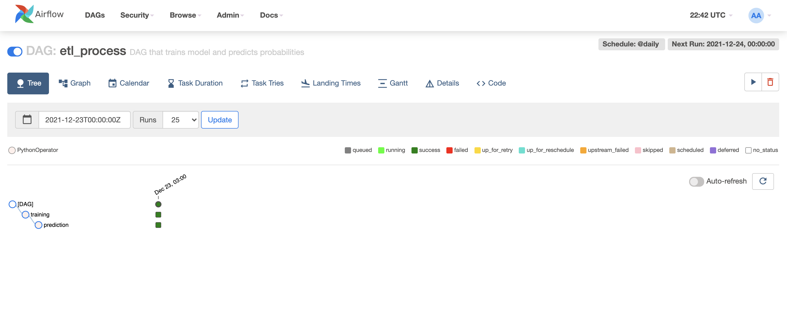

# match-prediction

This repository provides website for Premier League games predictions with scheduled workflow that updates games and probabilities.
### airlfow webserver: http://ec2-3-144-216-12.us-east-2.compute.amazonaws.com:8080/

### example web: 

### example airflow webserver: 

## Running

1. Go to this [website](https://www.football-data.org/)
and get your api token.

2. Replace line 19 in docker-compose-airflow.yaml and line 52 docker-compose.yaml with your api token.

3. Run webservice first using docker-compose
    * `docker-compose up`

4. Initialize airflow
    * `docker-compose -f docker-compose-airflow.yaml up airflow-init`

5. Run airflow
    * `docker-compose -f docker-compose-airflow.yaml up`

6. Visit http://match-prediction.localhost for webservice and localhost:8080 for airflow

## Todo list
### Todo

- [ ] Add another leagues
- [ ] Feature engineering
- [ ] Train rnn model
- [ ] Front(css, js)
- [ ] Train on more data
- [ ] Add tests

### In Progress

- [ ] Log metrics to MlFlow

### Done ✓

- [x] Training/prediction task with random forest 
- [x] Simple website
- [x] Airflow
